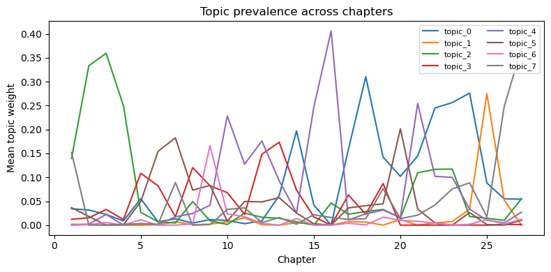
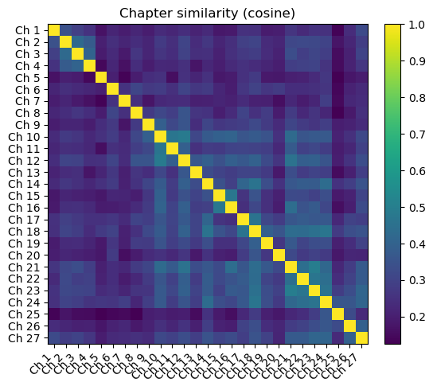
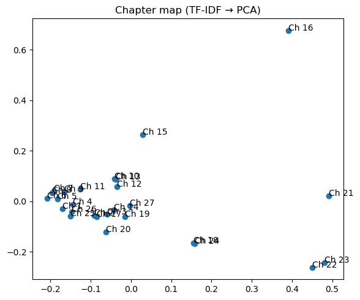
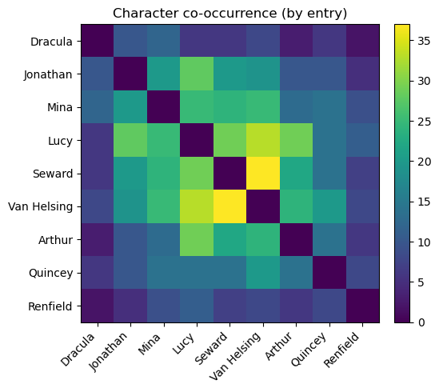

# Dracula Explorer (in progress)

Public-domain NLP/RAG mini-project exploring Bram Stoker's *Dracula*. This repo ships a clean JSON corpus
(chapter titles + narrator attribution) and a tiny analysis stack (TF–IDF retrieval, topic modeling, clustering,
and character co‑occurrence) with static README visuals **and** a lightweight Gradio demo.

---

## Repo layout
```
/src
  pipeline.py           # builds TF-IDF, topics, clusters, co-occurrence
  visuals.py            # returns matplotlib Figures
/scripts
  generate_static_charts.py   # writes PNGs to assets/charts
/assets/charts          # PNGs embedded below
/data                   # place JSON here (see below)
app.py                  # Gradio demo
README.md
requirements.txt
```

## Data inputs

Place **one** of the following into `data/`:

- `dracula_corrected_entries.json` ({"entries": [...]} including chapter_number, narrator, text, date_iso)
- or `dracula_ascii_rag.json` (array of chunks with `entry_index`, `chapter_number`, `narrator`, `text`, etc.)

> For quick start, copy the files you generated earlier into `data/`.

## Quick start

```bash
python -m venv .venv && . .venv/bin/activate  # (Windows: .venv\Scripts\activate)
pip install -r requirements.txt
python scripts/generate_static_charts.py      # writes PNGs to assets/charts
python app.py                                 # launches Gradio demo
```

## Textual Analysis Visuals

### Topic prevalence across chapters


### Chapter similarity (cosine)


### 2D map of chapters (TF-IDF → PCA)


### Character co-occurrence (by entry)


---

## Notes

- Charts use **matplotlib only**.
- Defaults are sane for a small corpus; tune topic count `n_topics`, cluster `k`, etc. in `scripts/generate_static_charts.py`.
- Optional future: Sentence-Transformers + FAISS/Chroma for semantic retrieval; kept out of the core for simplicity.
