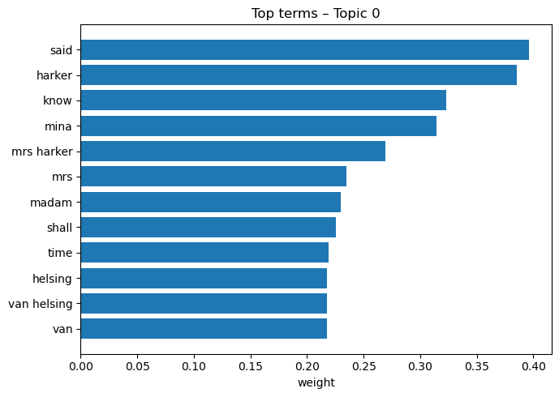

# Dracula Explorer — Charts Guide

> Place this file in `assets/charts/` and rename to `README.md`.

This folder stores pre-generated figures used in the main project README. Below is a practical guide to what each image shows and how to read it.

## Index
- [chapter_map.png](#chapter-map-tf-idf--pca)
- [chapter_similarity.png](#chapter-similarity-cosine)
- [character_cooccurrence.png](#character-co-occurrence-by-entry)
- [topic_terms_t0.png](#top-terms--topic-0-nmf)
- [topic_timeline.png](#topic-prevalence-across-chapters)

---

## Chapter map (TF-IDF → PCA)


**What it is:** Each chapter is turned into a TF‑IDF vector of distinctive words/phrases; PCA projects those vectors to 2D for visualization.

**How to read:** Points close together use similar vocabulary; far‑apart points are lexically different. Outliers often mark narrator shifts or unusual modes (e.g., medical notes vs. travel).

**Why it matters:** Fast way to see clusters of chapters that “talk alike” and to spot structural pivots.

---

## Chapter similarity (cosine)


**What it is:** Cosine similarity between chapter TF‑IDF vectors, aggregated by chapter. Brighter = more similar.

**How to read:** The diagonal is 1.0 (self-similarity). Bright off‑diagonal blocks suggest runs of similar chapters (same narrator/setting); dark bands imply stylistic outliers.

**Why it matters:** Quick scan for arcs, section boundaries, and outlier chapters that merit commentary.

---

## Character co-occurrence (by entry)


**What it is:** For each entry (our atomic unit), we detect which canonical character names appear, then count pairwise co‑mentions across entries.

**How to read:** Brighter cells mean two characters are frequently mentioned together.  
**Caveat:** Simple name matching only (no coreference); pronouns aren’t resolved.

**Why it matters:** Rough map of who tends to share scenes/plot beats.

---

## Top terms — Topic 0 (NMF)


**What it is:** Non‑negative Matrix Factorization (NMF) decomposes the corpus into latent topics. This bar chart shows the highest‑weight terms for Topic 0 (edit `n_topics` to explore others).

**How to read:** Terms collectively hint at a theme. Topics aren’t labeled—name them based on these top terms.

**Why it matters:** Gives concise thematic handles you can reference in prose.

---

## Topic prevalence across chapters


**What it is:** Average topic weights per chapter plotted over chapter index.

**How to read:** Peaks show where a topic dominates; watch for hand‑offs where one topic falls as another rises (often narratorial or plot pivots).

**Caveat:** Vocabulary‑based; great for structure, not literal plot truth.

---

## Regenerating these figures

From the repo root (not this folder):
```bash
python scripts/generate_static_charts.py
```
Outputs will overwrite the PNGs in this directory.
