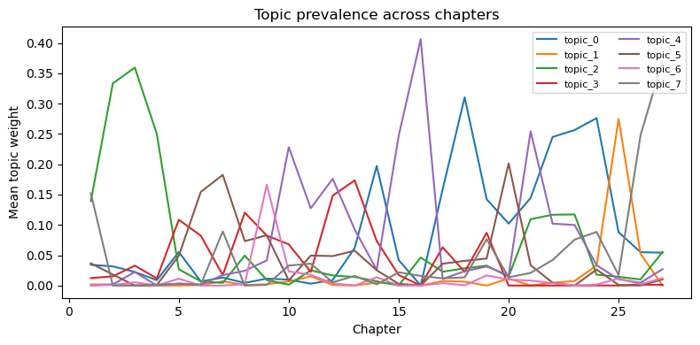
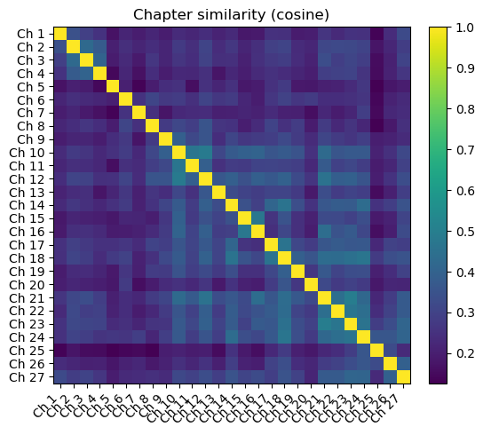
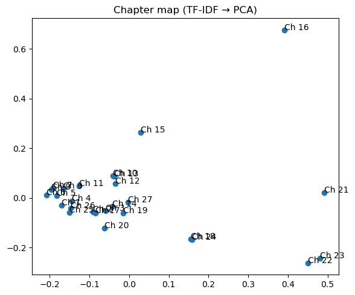
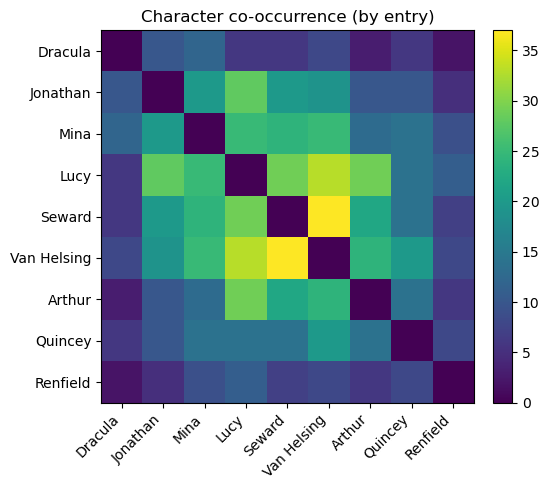

# Dracula Explorer

Public-domain NLP/RAG mini-project exploring Bram Stoker’s Dracula. Ships a clean JSON corpus (chapter titles + narrator attribution), classic analysis (TF-IDF, topics, clustering, character co-occurrence) with static charts and a lightweight local, offline RAG chat agent powered by Ollama.

---
## Features

  - Structured corpus of Dracula (entries with chapter_number, narrator, date_iso, text).
  
  - Static visuals embedded in the README (topic timeline, chapter map/similarity, co-occurrence).
  
  - RAG Q&A (table view) and Chatbot UI with citations and source table.
  
  - Offline-first: works with small local models via Ollama (e.g., llama3.2:3b).

```

## Repo layout

DraculaExplorer/
├─ assets/
│ └─ charts/ # pre-generated figures embedded in README
│ ├─ chapter_map.png
│ ├─ chapter_similarity.png
│ ├─ character_cooccurrence.png
│ ├─ topic_terms_t0.png
│ ├─ topic_timeline.png
│ └─ README_charts.md # short explainer for the charts (optional)
├─ data/
│ └─ dracula_ascii_rag.json # structured corpus (entries with meta)
├─ notebooks/
│ └─ README.md # notes on exploratory notebooks (placeholder)
├─ scripts/
│ ├─ generate_static_charts.py # regenerates figures into assets/charts/
│ └─ health_check.py # verifies data file + Ollama availability
├─ src/
│ ├─ init.py
│ ├─ pipeline.py # TF-IDF, topics (NMF), clustering, similarity
│ ├─ visuals.py # matplotlib plot helpers used by scripts/*
│ ├─ rag.py # lightweight RAG backend (TF-IDF + Ollama/HF)
│ └─ chatbot.py # chat wrapper over rag.py (history + prompt)
├─ app.py # (optional) minimal viz/demo app
├─ app_rag.py # one-shot Q&A UI (table of retrieved passages)
├─ app_chatbot.py # chat UI with sources table (local Ollama)
├─ demo_rag_cli.py # CLI: ask a question from the terminal
├─ LICENSE
├─ README_RAG.md # deeper RAG notes (optional)
├─ README.md # main project README (this file)
└─ requirements.txt # Python deps (pip)
```
## Data

Put one of these in data/:

dracula_corrected_entries.json – {"entries":[...]} with chapter_number, narrator, date_iso, text

or dracula_ascii_rag.json – list of entries with the same fields

## Setup
python -m pip install -r requirements.txt
# optional sanity check
  python scripts/health_check.py
  
  
  Ollama is a separate system app (not a pip package). Install it and pull a small model once:
  
  winget install Ollama.Ollama
  ollama pull llama3.2:3b


## How the Chatbot Works (brief)

Entry-level retrieval: TF-IDF is computed over chunks, then collapsed to entry centroids, so we rank by entry (prevents mixing chapters).

Soft constraints from the query: If you ask for “Jonathan’s first entry” or mention a chapter, the retriever adds a gentle bias toward that narrator/chapter and prefers earlier chapters for “first.”

Evidence-first prompting: The model is asked to list short evidence bullets (with [1] cites) before composing the answer—reduces drift and keeps responses grounded.


## Data inputs

Place **one** of the following into `data/`:

- `dracula_corrected_entries.json` ({"entries": [...]} including chapter_number, narrator, text, date_iso)
- or `dracula_ascii_rag.json` (array of chunks with `entry_index`, `chapter_number`, `narrator`, `text`, etc.)

> For quick start, copy the files you generated earlier into `data/`.

### Quickstart

```bash
# 0) Dependencies
python -m pip install -r requirements.txt

# 1) Make sure Ollama is installed & running (system app, not pip)
#    Windows: winget install Ollama.Ollama
#    macOS:   brew install ollama
#    Then pull a small model once:
ollama pull llama3.2:3b

# 2) Health check (data + Ollama)
python scripts/health_check.py

# 3) Launch the chat UI
python app_chatbot.py
```

## Textual Analysis Visuals

### Topic prevalence across chapters


**What it is:** Average topic weights per chapter plotted over chapter index.

**How to read:** Peaks show where a topic dominates; watch for hand‑offs where one topic falls as another rises (often narratorial or plot pivots).

**Caveat:** Vocabulary‑based; great for structure, not literal plot truth.


### Chapter similarity (cosine)


**What it is:** Cosine similarity between chapter TF‑IDF vectors, aggregated by chapter. Brighter = more similar.

**How to read:** The diagonal is 1.0 (self-similarity). Bright off‑diagonal blocks suggest runs of similar chapters (same narrator/setting); dark bands imply stylistic outliers.

**Why it matters:** Quick scan for arcs, section boundaries, and outlier chapters that merit commentary.


### 2D map of chapters (TF-IDF → PCA)


**What it is:** Each chapter is turned into a TF‑IDF vector of distinctive words/phrases; PCA projects those vectors to 2D for visualization.

**How to read:** Points close together use similar vocabulary; far‑apart points are lexically different. Outliers often mark narrator shifts or unusual modes (e.g., medical notes vs. travel).

**Why it matters:** Fast way to see clusters of chapters that “talk alike” and to spot structural pivots.


### Character co-occurrence (by entry)


**What it is:** For each entry (our atomic unit), we detect which canonical character names appear, then count pairwise co‑mentions across entries.

**How to read:** Lighter cells mean two characters are frequently mentioned together.  
**Caveat:** Simple name matching only (no coreference); pronouns aren’t resolved.

**Why it matters:** Rough map of who tends to share scenes/plot beats.

---
## Notes

- Charts use **matplotlib only**.
- Defaults are sane for a small corpus; tune topic count `n_topics`, cluster `k`, etc. in `scripts/generate_static_charts.py`.
- Optional future: Sentence-Transformers + FAISS/Chroma for semantic retrieval; kept out of the core for simplicity.

## Chapters

1. **CHAPTER I — Jonathan Harker's Journal**  
2. **CHAPTER II — Jonathan Harker's Journal**  
3. **CHAPTER III — Jonathan Harker's Journal**  
4. **CHAPTER IV — Jonathan Harker's Journal**  
5. **CHAPTER V — Letters — Lucy and Mina** *(epistolary)*  
6. **CHAPTER VI — Mina Murray's Journal**  
7. **CHAPTER VII — Cutting from "The Dailygraph," 8 August** *(newspaper)*  
8. **CHAPTER VIII — Mina Murray's Journal**  
9. **CHAPTER IX — Mina Murray's Journal**  
10. **CHAPTER X — Mina Murray's Journal**  
11. **CHAPTER XI — Lucy Westenra's Diary**  
12. **CHAPTER XII — Dr. Seward's Diary**  
13. **CHAPTER XIII — Dr. Seward's Diary**  
14. **CHAPTER XIV — Mina Harker's Journal**  
15. **CHAPTER XV — Dr. Seward's Diary**  
16. **CHAPTER XVI — Dr. Seward's Diary**  
17. **CHAPTER XVII — Dr. Seward's Diary**  
18. **CHAPTER XVIII — Dr. Seward's Diary**  
19. **CHAPTER XIX — Jonathan Harker's Journal**  
20. **CHAPTER XX — Jonathan Harker's Journal**  
21. **CHAPTER XXI — Dr. Seward's Diary**  
22. **CHAPTER XXII — Jonathan Harker's Journal**  
23. **CHAPTER XXIII — Dr. Seward's Diary**  
24. **CHAPTER XXIV — Dr. Seward's Phonograph Diary, spoken by Van Helsing** *(Van Helsing dictating)*  
25. **CHAPTER XXV — Dr. Seward's Diary**  
26. **CHAPTER XXVI — Dr. Seward's Diary**  
27. **CHAPTER XXVII — Mina Harker's Journal**

> **Narrator key:** Jonathan Harker, Mina Murray/Harker, Lucy Westenra, Dr. John Seward, Abraham Van Helsing (via Seward’s phonograph), plus ephemera (letters, newspaper cutting).

---

## Main Characters (quick reference)

- **Count Dracula** — Ancient Transylvanian noble and vampire. Charismatic, predatory, a strategist who exploits modern logistics (steamships, rail) to expand his reach. Symbol of invasive, undead aristocracy.

- **Jonathan Harker** — Young English solicitor. His travel diary (Ch. I–IV) is the reader’s first lens on Dracula’s castle and methods. Later becomes an active hunter; steady, precise, legal-minded.

- **Mina Murray / Mina Harker** — Schoolteacher, later Jonathan’s wife. Organized, analytical, and emotionally resilient; her journals and typing/compilation literally hold the team’s evidence together. Moral center of the group.

- **Lucy Westenra** — Mina’s close friend. Charming and kind, courted by three suitors. Her illness and transformation are the novel’s most immediate tragedy and motivate the hunters’ resolve.

- **Dr. John Seward** — Physician who runs a London asylum; narrator for many middle chapters. Clinical observer whose diary/phonograph notes track Renfield and the medical fight to diagnose Lucy.

- **Professor Abraham Van Helsing** — Dutch polymath physician and mentor to Seward. Combines science, folklore, and faith; coordinates the group’s tactics. Dictates one chapter’s notes to Seward’s phonograph.

- **Arthur Holmwood (Lord Godalming)** — Lucy’s fiancé (later husband) and one of the hunters. Represents duty and sacrifice; funds and backs the group.

- **Quincey P. Morris** — American adventurer and hunter. Practical, brave, and decisive; key actor in the final pursuit.

- **R. M. Renfield** — Seward’s patient. His fixation on consuming life (flies → spiders → birds) mirrors Dracula’s predation. Acts as a tragic barometer for the Count’s proximity and influence.

- **Mrs. Westenra** — Lucy’s mother; well-meaning but misinformed early on, which worsens Lucy’s condition.

- **Sister Agatha & other minor figures** — Helpers who appear in hospital/rail/ship contexts; small but pivotal in the investigative chain.
